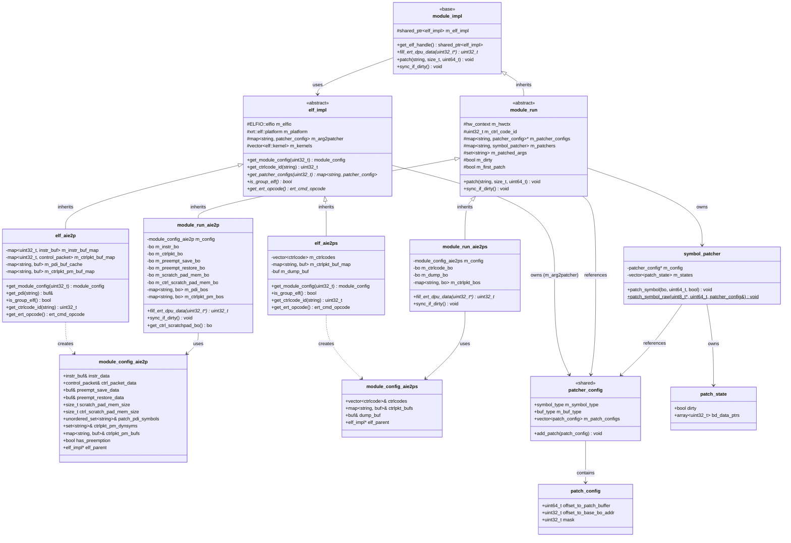

# XRT ELF and Module Architecture Documentation

## Overview

This document describes the architecture and changes made to the XRT ELF and Module subsystem between commits `4e6abd6988fbc33b1c04446fe301aa75d8fab40` and `cf66705e5996fd964e27ffbe6755fbf21b4b72d0`.

### Summary of Changes

The refactoring introduced a significant redesign of the ELF patching system and module architecture:

1. **Thread-Safe Patching System**: Separated static configuration from runtime state
2. **Reduced Code Duplication**: Massive reduction in `xrt_module.cpp` (3556 lines reduced to 1441 lines)
3. **Platform-Specific Configuration Structures**: Introduced `module_config_aie2p` and `module_config_aie2ps`
4. **Improved Symbol Patcher Design**: Split patcher into config (shared) and state (per-instance)

---

## Architecture Overview

```
┌─────────────────────────────────────────────────────────────┐
│                    User API Layer                           │
│                  xrt::elf, xrt::module                      │
└───────────────────────┬─────────────────────────────────────┘
                        │
┌───────────────────────▼─────────────────────────────────────┐
│              Implementation Layer                           │
│  ┌────────────────┐      ┌──────────────────┐              │
│  │  elf_impl      │      │  module_impl     │              │
│  │  (abstract)    │      │  (base)          │              │
│  └───────┬────────┘      └────────┬─────────┘              │
│          │                        │                         │
│  ┌───────▼────────┐      ┌────────▼─────────┐              │
│  │  elf_aie2p     │      │  module_run      │              │
│  │  elf_aie2ps    │      │  (abstract)      │              │
│  └────────────────┘      └────────┬─────────┘              │
│                          ┌─────────▼──────────┐             │
│                          │ module_run_aie2p   │             │
│                          │ module_run_aie2ps  │             │
│                          └────────────────────┘             │
└─────────────────────────────────────────────────────────────┘
                        │
┌───────────────────────▼─────────────────────────────────────┐
│              Patching System                                │
│  ┌────────────────┐    ┌──────────────────┐                │
│  │ patcher_config │───▶│ symbol_patcher   │                │
│  │  (shared)      │    │  (per-instance)  │                │
│  └────────────────┘    └──────────────────┘                │
└─────────────────────────────────────────────────────────────┘
```

---

## Class Diagram with Dependencies



---

## File-by-File Summary

### 1. `elf_int.h`

**Purpose**: Internal interface for ELF implementation, exposing `elf_impl` and platform-specific configuration structures.

**Key Classes**:
- **`buf`**: Wrapper for holding ELF section data
- **`module_config_aie2p`**: Configuration structure for AIE2P platform
- **`module_config_aie2ps`**: Configuration structure for AIE2PS platform
- **`elf_impl`**: Abstract base class for ELF implementation

**Key Changes**:
- Added `module_config_aie2p` and `module_config_aie2ps` structures
- Introduced `module_config` variant type for platform-specific configurations
- Added `get_module_config()` virtual method to return platform-specific config
- Moved patcher-related type aliases into `elf_impl` class
- Made many members protected for direct access in derived classes
- Added `get_patcher_configs()` method to return pointer to shared configs

**Dependencies**:
- Uses `elf_patcher.h` for patcher types
- Uses `ELFIO` library for ELF parsing
- Depends on `xrt_core::xclbin::kernel_argument` type

**Class Relationships**:
```
elf_impl (abstract base)
   ├── Protected Members:
   │   ├── m_elfio (ELFIO::elfio)
   │   ├── m_platform (xrt::elf::platform)
   │   ├── m_arg2patcher (map of ctrl_code_id -> map of arg_name -> patcher_config)
   │   └── m_kernels (vector of elf::kernel)
   │
   ├── Virtual Methods:
   │   ├── is_group_elf() = 0
   │   ├── get_module_config(ctrl_code_id) = 0
   │   ├── get_ctrlcode_id(name) = 0
   │   └── get_ert_opcode() = 0
   │
   └── Derived Classes:
       ├── elf_aie2p (AIE2P platform implementation)
       └── elf_aie2ps (AIE2PS/AIE4 platform implementation)
```

---

### 2. `elf_patcher.h`

**Purpose**: Defines patching system with separation between static configuration and runtime state.

**Key Classes**:
- **`patcher_config`**: Static configuration for a patcher (shared across instances)
- **`patch_config`**: Configuration for a single patch location
- **`symbol_patcher`**: Runtime patcher holding config reference and per-instance state
- **`patch_state`**: Runtime state per patch location

**Key Enums**:
- **`buf_type`**: Types of buffers that support patching (ctrltext, ctrldata, pdi, etc.)
- **`symbol_type`**: Patching schemes for different symbol types

**Key Changes**:
- Split patcher design into static config (`patcher_config`) and runtime state (`patch_state`)
- `symbol_patcher` now holds pointer to shared `patcher_config` and owns its own state vector
- Added `patch_symbol_raw()` static method for raw buffer patching (shim tests)
- Increased `max_bd_words` from 8 to 9 for AIE4/AIE2PS support
- Added new symbol types for AIE4 and AIE2PS

**Thread Safety Design**:
```
┌────────────────────────────────────────────┐
│         elf_impl (singleton)               │
│  ┌──────────────────────────────────────┐  │
│  │ m_arg2patcher                        │  │
│  │  map<ctrl_code_id,                   │  │
│  │      map<arg_name, patcher_config>>  │  │
│  │  (shared, read-only after parsing)   │  │
│  └──────────────────────────────────────┘  │
└──────────────────┬─────────────────────────┘
                   │ pointer reference
                   │
    ┌──────────────▼──────────────┐
    │   module_run (instance 1)   │
    │  ┌────────────────────────┐ │
    │  │ m_patcher_configs      │─┼──> points to shared config
    │  │ (const pointer)        │ │
    │  └────────────────────────┘ │
    │  ┌────────────────────────┐ │
    │  │ m_patchers             │ │
    │  │  map<arg_name,         │ │
    │  │      symbol_patcher>   │ │
    │  │  (per-instance state)  │ │
    │  └────────────────────────┘ │
    └─────────────────────────────┘
    
    ┌─────────────────────────────┐
    │   module_run (instance 2)   │
    │  ┌────────────────────────┐ │
    │  │ m_patcher_configs      │─┼──> points to same shared config
    │  │ (const pointer)        │ │
    │  └────────────────────────┘ │
    │  ┌────────────────────────┐ │
    │  │ m_patchers             │ │
    │  │  (different state)     │ │
    │  └────────────────────────┘ │
    └─────────────────────────────┘
```

**Dependencies**:
- Uses `xrt::bo` for buffer objects
- Independent header with minimal dependencies

---

### 3. `elf_patcher.cpp`

**Purpose**: Implements the patching logic for different symbol types and buffer types.

**Key Functions**:
- **`patcher_config::patcher_config()`**: Constructor for creating config during ELF parsing
- **`symbol_patcher::symbol_patcher()`**: Constructor that initializes state from config
- **`symbol_patcher::patch_symbol()`**: Main patching function that uses state
- **`symbol_patcher::patch_symbol_raw()`**: Static method for raw buffer patching
- **Platform-specific patchers**: `patch57()`, `patch48()`, `patch_ctrl57()`, etc.

**Key Changes**:
- Moved patching logic into separate translation unit
- Implemented state management for dirty tracking and buffer caching
- Added raw patching support for shim tests
- Implemented platform-specific patching functions for AIE4 and AIE2PS

**Dependencies**:
- Depends on `elf_patcher.h`
- Uses `xrt::bo` for buffer operations

---

### 4. `module_int.h`

**Purpose**: Internal interface for module implementation, exposing module creation and patching functions.

**Key Functions**:
- **`create_module_run()`**: Creates module object for execution
- **`get_elf_handle()`**: Gets underlying ELF handle from module
- **`fill_ert_dpu_data()`**: Fills ERT command payload
- **`patch()`**: Multiple overloads for patching buffers and scalars
- **`sync()`**: Syncs patched buffer to device
- **`get_patch_buf_size()`**: Returns patch buffer size
- **`dump_dtrace_buffer()`**: Dumps dynamic trace buffer
- **`get_ctrl_scratchpad_bo()`**: Returns control scratchpad buffer object

**Key Changes**:
- Updated function signatures to accept `ctrl_code_id` parameter for multi-control-code support
- Added default parameter for `ctrl_code_id` with value `xrt_core::elf_int::no_ctrl_code_id`
- Simplified API by removing platform-specific variants

**Dependencies**:
- Depends on `elf_int.h` for `elf_impl` and config structures
- Uses `xrt::module`, `xrt::elf`, `xrt::hw_context`, `xrt::bo`
- Uses `elf_patcher.h` for `buf_type` enum

---

### 5. `xrt_elf.cpp`

**Purpose**: Implementation of ELF parsing and platform-specific derived classes (`elf_aie2p`, `elf_aie2ps`).

**Key Classes (Implementation)**:
- **`elf_aie2p`**: AIE2P platform-specific ELF implementation
- **`elf_aie2ps`**: AIE2PS/AIE4 platform-specific ELF implementation

**Key Changes**:
- Refactored parsing logic to populate `m_arg2patcher` map during ELF parsing
- Implemented `get_module_config()` in derived classes to return platform-specific configs
- Moved buffer creation logic out of ELF parsing (now done by `module_run`)
- Simplified control code ID lookup with unified `get_ctrlcode_id()` method
- Removed redundant platform-specific config getters

**elf_aie2p Members**:
```
Private Members:
├── m_instr_buf_map (map<ctrl_code_id, instr_buf>)
├── m_ctrlpkt_buf_map (map<ctrl_code_id, control_packet>)
├── m_preempt_save_buf_map (map<ctrl_code_id, buf>)
├── m_preempt_restore_buf_map (map<ctrl_code_id, buf>)
├── m_pdi_buf_cache (map<symbol_name, buf>)
├── m_ctrlpkt_pm_buf_map (map<section_name, buf>)
├── m_patch_pdi_symbols (unordered_set<string>)
├── m_ctrlpkt_pm_dynsyms (set<string>)
├── m_scratch_pad_mem_size (size_t)
└── m_ctrl_scratch_pad_mem_size (size_t)
```

**elf_aie2ps Members**:
```
Private Members:
├── m_ctrlcodes (vector<ctrlcode>)
├── m_ctrlpkt_buf_map (map<section_name, buf>)
└── m_dump_buf (buf)
```

**Dependencies**:
- Depends on `elf_int.h` for base class
- Depends on `elf_patcher.h` for patcher types
- Uses ELFIO library extensively for ELF parsing

---

### 6. `xrt_module.cpp`

**Purpose**: Implementation of module classes and patching logic.

**Key Classes (Implementation)**:
- **`module_impl`**: Base implementation class
- **`module_run`**: Abstract class for module with hardware context
- **`module_run_aie2p`**: AIE2P platform-specific module implementation
- **`module_run_aie2ps`**: AIE2PS/AIE4 platform-specific module implementation

**Key Changes**:
- **Massive code reduction**: From ~3700 lines to ~1400 lines (60% reduction)
- Removed platform-specific static config duplication
- Simplified buffer creation by using platform-specific config structures
- Lazy patcher creation: `symbol_patcher` created on first use
- Unified patching logic using `symbol_patcher` class

**module_run_aie2p Members**:
```
Private Members:
├── m_config (module_config_aie2p) - references to ELF data
├── m_instr_bo (xrt::bo) - instruction buffer
├── m_ctrlpkt_bo (xrt::bo) - control packet buffer
├── m_preempt_save_bo (xrt::bo) - preemption save buffer
├── m_preempt_restore_bo (xrt::bo) - preemption restore buffer
├── m_scratch_pad_mem_bo (xrt::bo) - scratch pad memory
├── m_ctrl_scratch_pad_mem_bo (xrt::bo) - control scratch pad memory
├── m_pdi_bos (map<symbol, bo>) - PDI buffers
└── m_ctrlpkt_pm_bos (map<symbol, bo>) - control packet preemption buffers
```

**module_run_aie2ps Members**:
```
Private Members:
├── m_config (module_config_aie2ps) - references to ELF data
├── m_ctrlcode_bo (xrt::bo) - control code buffer
├── m_dump_bo (xrt::bo) - dump/trace buffer
└── m_ctrlpkt_bos (map<symbol, bo>) - control packet buffers
```

**Patching Flow**:
```
1. User calls module::patch(arg_name, index, bo)
   │
   ├──> module_run::patch(arg_name, index, value)
   │
   ├──> Look up patcher for arg_name
   │    │
   │    ├── If patcher doesn't exist:
   │    │   ├── Get shared config from elf_impl
   │    │   └── Create symbol_patcher with config pointer
   │    │
   │    └── If patcher exists: use existing
   │
   ├──> Call symbol_patcher::patch_symbol(bo, value, first)
   │    │
   │    ├── For each patch location in config:
   │    │   ├── Get buffer pointer (instr/ctrlpkt/pdi/etc)
   │    │   ├── Map buffer to CPU memory
   │    │   ├── Apply patch based on symbol_type
   │    │   ├── Update state (dirty flag, cached values)
   │    │   └── Sync buffer if needed
   │    │
   │    └── Return
   │
   ├──> Mark arg as patched
   └──> Set dirty flag
```

**Dependencies**:
- Depends on `module_int.h` for interface
- Depends on `elf_int.h` for ELF access
- Depends on `elf_patcher.h` for patching
- Uses `xrt::bo`, `xrt::hw_context` extensively

---

### 7. `hw_context_int.h`

**Purpose**: Internal interface for hardware context, provides access to device and ELF registration.

**Key Functions**:
- **`get_core_device()`**: Gets core device from context
- **`get_elf()`**: Returns ELF with given kernel name
- **`get_elf_flow()`**: Checks if context was created with ELF flow
- **`get_elf_map()`**: Returns map of kernel names to ELF files

**Key Changes**:
- Added `get_elf()` function to retrieve ELF by kernel name
- Added `get_elf_map()` function for XDP integration

**Dependencies**:
- Depends on `xrt::hw_context`, `xrt::elf`, `xrt::module`
- Used by module implementation to access device

---

### 8. `xrt_hw_context.cpp`

**Purpose**: Implementation of hardware context with ELF registration.

**Key Changes**:
- Added ELF registration map (`m_elf_map`) to store ELFs by kernel name
- Implemented `get_elf()` to lookup ELF by kernel name
- Implemented `get_elf_map()` to return copy of registration map

**Dependencies**:
- Depends on `hw_context_int.h`
- Manages lifetime of registered ELFs

---

### 9. `xrt_kernel.cpp`

**Purpose**: Implementation of kernel execution using modules.

**Key Changes**:
- Updated to use new module interface with `ctrl_code_id`
- Simplified kernel argument patching using module patching API
- Updated ERT command filling to use `fill_ert_dpu_data()`

**Dependencies**:
- Depends on `module_int.h` for module operations
- Uses `xrt::module` for execution

---

### 10. `hook_xrt_module.cpp`

**Purpose**: XBTracer hooks for module API tracing.

**Key Changes**:
- Simplified hooks due to reduced API surface
- Removed platform-specific variant hooks
- Updated to trace unified module API

**Dependencies**:
- Depends on `xrt::module` API
- Used by XBTracer for profiling

---

### 11. `xrt_elf.h` (Public API)

**Purpose**: Public API for ELF objects.

**Key Changes**:
- Added `get_handle()` method to access internal implementation
- Minor documentation updates

**Dependencies**:
- Public header with minimal dependencies

---

### 12. `xrt_module.h` (Public API)

**Purpose**: Public API for module objects.

**Key Changes**:
- No significant changes to public API
- Implementation details hidden in `module_impl`

**Dependencies**:
- Public header with minimal dependencies

---

## Key Design Patterns

### 1. **Strategy Pattern** (Platform-Specific Implementations)

The architecture uses the strategy pattern for platform-specific behavior:

```cpp
// elf_impl defines the interface
class elf_impl {
    virtual module_config get_module_config(uint32_t ctrl_code_id) = 0;
    virtual uint32_t get_ctrlcode_id(const std::string& name) const = 0;
};

// Platform-specific implementations
class elf_aie2p : public elf_impl { ... };
class elf_aie2ps : public elf_impl { ... };
```

### 2. **Separation of Concerns** (Config vs State)

The patching system separates static configuration from runtime state:

```cpp
// Static config (shared, read-only)
struct patcher_config {
    symbol_type m_symbol_type;
    buf_type m_buf_type;
    std::vector<patch_config> m_patch_configs;
};

// Runtime state (per-instance, mutable)
struct patch_state {
    bool dirty;
    std::array<uint32_t, max_bd_words> bd_data_ptrs;
};

// Patcher combines both
struct symbol_patcher {
    const patcher_config* m_config;  // pointer to shared
    std::vector<patch_state> m_states;  // owned state
};
```

### 3. **Lazy Initialization** (Patcher Creation)

Patchers are created on-demand to avoid unnecessary overhead:

```cpp
void module_run::patch(const std::string& argnm, size_t index, uint64_t value) {
    // Create patcher only when needed
    auto it = m_patchers.find(argnm);
    if (it == m_patchers.end()) {
        auto* config = elf_impl->get_patcher_configs(m_ctrl_code_id);
        auto cfg_it = config->find(argnm);
        m_patchers.emplace(argnm, symbol_patcher(&cfg_it->second));
        it = m_patchers.find(argnm);
    }
    // Use patcher
    it->second.patch_symbol(...);
}
```

### 4. **Variant Type** (Platform-Specific Config)

Uses `std::variant` for type-safe platform-specific configurations:

```cpp
using module_config = std::variant<module_config_aie2p, module_config_aie2ps>;

// In elf_aie2p
module_config elf_aie2p::get_module_config(uint32_t ctrl_code_id) {
    return module_config_aie2p{...};
}

// In elf_aie2ps
module_config elf_aie2ps::get_module_config(uint32_t ctrl_code_id) {
    return module_config_aie2ps{...};
}
```

---

## Data Flow

### ELF Parsing and Module Creation Flow

```
1. User creates xrt::elf object
   │
   ├──> Load ELFIO from file/buffer
   │
   ├──> Determine platform (AIE2P/AIE2PS)
   │
   ├──> Create platform-specific elf_impl
   │    ├── elf_aie2p or elf_aie2ps
   │    │
   │    ├──> Parse .group sections
   │    │    └── Populate m_section_to_group_map, m_group_to_sections_map
   │    │
   │    ├──> Parse section data
   │    │    └── Populate platform-specific buffer maps
   │    │         ├── AIE2P: m_instr_buf_map, m_ctrlpkt_buf_map, etc.
   │    │         └── AIE2PS: m_ctrlcodes, m_ctrlpkt_buf_map, etc.
   │    │
   │    ├──> Parse .rela sections
   │    │    └── Build m_arg2patcher map
   │    │         └── map<ctrl_code_id, map<arg_name, patcher_config>>
   │    │
   │    └──> Parse kernel information
   │         └── Build m_kernels vector
   │
   └──> Return xrt::elf

2. User creates xrt::hw_context with xrt::elf
   │
   └──> Register ELF with kernel names

3. User creates xrt::run object
   │
   ├──> Get ELF from hw_context
   │
   ├──> Get ctrl_code_id from kernel name
   │
   ├──> Call create_module_run(elf, hwctx, ctrl_code_id, ctrlpkt_bo)
   │    │
   │    ├──> Get module_config from elf_impl
   │    │    └── Returns variant<module_config_aie2p, module_config_aie2ps>
   │    │
   │    ├──> Visit variant and create platform-specific module_run
   │    │    ├── AIE2P: create module_run_aie2p
   │    │    │    ├── Store config (references to ELF buffers)
   │    │    │    ├── Create BOs from ELF buffer data
   │    │    │    │    ├── m_instr_bo
   │    │    │    │    ├── m_ctrlpkt_bo
   │    │    │    │    ├── m_preempt_save_bo
   │    │    │    │    ├── m_preempt_restore_bo
   │    │    │    │    ├── m_scratch_pad_mem_bo
   │    │    │    │    └── m_ctrl_scratch_pad_mem_bo
   │    │    │    └── Get patcher configs pointer
   │    │    │
   │    │    └── AIE2PS: create module_run_aie2ps
   │    │         ├── Store config (references to ELF buffers)
   │    │         ├── Create BOs from ELF buffer data
   │    │         │    ├── m_ctrlcode_bo
   │    │         │    └── m_dump_bo
   │    │         └── Get patcher configs pointer
   │    │
   │    └──> Return xrt::module
   │
   └──> Store module in xrt::run
```

### Patching Flow

```
1. User sets kernel arguments
   │
   ├──> xrt::run::set_arg(index, bo)
   │
   └──> module::patch(arg_name, index, value)
        │
        ├──> module_run::patch(arg_name, index, value)
        │    │
        │    ├──> Get or create symbol_patcher for arg_name
        │    │    │
        │    │    ├── If not exists:
        │    │    │    ├── Get patcher_config* from elf_impl
        │    │    │    │    └── m_patcher_configs->find(arg_name)
        │    │    │    │
        │    │    │    └── Create symbol_patcher(&config)
        │    │    │         └── Initialize m_states vector
        │    │    │
        │    │    └── Return existing patcher
        │    │
        │    ├──> Call patcher.patch_symbol(bo, value, m_first_patch)
        │    │    │
        │    │    ├── For each patch_config in patcher_config:
        │    │    │    │
        │    │    │    ├── Get target buffer based on buf_type
        │    │    │    │    ├── ctrltext -> m_instr_bo
        │    │    │    │    ├── ctrldata -> m_ctrlpkt_bo
        │    │    │    │    ├── pdi -> m_pdi_bos[symbol]
        │    │    │    │    └── etc.
        │    │    │    │
        │    │    │    ├── Map buffer to get uint8_t* base pointer
        │    │    │    │
        │    │    │    ├── Calculate patch location
        │    │    │    │    └── base + patch_config.offset_to_patch_buffer
        │    │    │    │
        │    │    │    ├── Calculate patch value
        │    │    │    │    └── bo.address() + patch_config.offset_to_base_bo_addr
        │    │    │    │
        │    │    │    ├── Apply patch based on symbol_type
        │    │    │    │    ├── shim_dma_48 -> patch_shim48()
        │    │    │    │    ├── control_packet_48 -> patch_ctrl48()
        │    │    │    │    ├── control_packet_57 -> patch_ctrl57()
        │    │    │    │    ├── control_packet_57_aie4 -> patch_ctrl57_aie4()
        │    │    │    │    ├── scalar_32bit_kind -> patch32()
        │    │    │    │    └── address_64 -> patch64()
        │    │    │    │
        │    │    │    ├── Update patch_state
        │    │    │    │    ├── Set dirty = true
        │    │    │    │    └── Cache original values if needed
        │    │    │    │
        │    │    │    └── Sync buffer if first patch or if needed
        │    │    │
        │    │    └── Return
        │    │
        │    ├──> Add arg_name to m_patched_args set
        │    │
        │    └──> Set m_dirty = true
        │
        └──> Return

2. User starts kernel execution
   │
   ├──> xrt::run::start()
   │
   ├──> module::sync_if_dirty()
   │    │
   │    ├──> Check all required args are patched
   │    │
   │    ├──> If m_dirty:
   │    │    ├── Sync all buffer objects
   │    │    └── Set m_dirty = false
   │    │
   │    └──> Set m_first_patch = false
   │
   └──> Submit command to device
```

---

## Benefits of the Refactoring

### 1. **Thread Safety**
- Static configuration is shared and read-only
- Each module instance has its own runtime state
- No race conditions when multiple threads use same ELF

### 2. **Reduced Code Duplication**
- Platform-specific logic encapsulated in derived classes
- Shared patching logic in `symbol_patcher`
- Eliminated redundant buffer creation code

### 3. **Improved Maintainability**
- Clear separation of concerns (config vs state)
- Easier to add new platforms
- Easier to add new patching schemes

### 4. **Better Performance**
- Lazy patcher creation (avoid overhead for unused args)
- Dirty tracking reduces unnecessary syncs
- Shared config reduces memory footprint

### 5. **Cleaner API**
- Unified module interface (no platform-specific variants)
- Control code ID parameter for multi-kernel support
- Consistent error handling

---

## Migration Guide

For developers working with the old API:

### Old Code Pattern:
```cpp
// Old: Platform-specific module creation
auto module_aie2p = create_module_aie2p(elf, hwctx);
auto module_aie2ps = create_module_aie2ps(elf, hwctx);

// Old: Platform-specific patching
patch_aie2p(module_aie2p, arg_name, value);
patch_aie2ps(module_aie2ps, arg_name, value);
```

### New Code Pattern:
```cpp
// New: Unified module creation with ctrl_code_id
auto ctrl_code_id = elf.get_ctrlcode_id(kernel_name);
auto module = create_module_run(elf, hwctx, ctrl_code_id, ctrlpkt_bo);

// New: Unified patching interface
module::patch(arg_name, index, value);
```

---

## Testing Considerations

### Unit Tests Should Cover:

1. **ELF Parsing**:
   - Legacy ELFs (no .group sections)
   - New ELFs (with .group sections)
   - Multiple control codes
   - Platform-specific sections

2. **Patching**:
   - All symbol types (shim48, ctrl48, ctrl57, ctrl57_aie4, etc.)
   - All buffer types (ctrltext, ctrldata, pdi, ctrlpkt, etc.)
   - Multiple patches per argument
   - Dirty tracking and sync behavior

3. **Thread Safety**:
   - Multiple module instances from same ELF
   - Concurrent patching operations
   - Shared config immutability

4. **Platform-Specific Logic**:
   - AIE2P: instruction buffer, control packet, preemption, PDI
   - AIE2PS: control code, control packet, dump buffer

---

## Future Enhancements

Potential areas for improvement:

1. **Memory Optimization**:
   - Consider using memory-mapped files for large ELFs
   - Lazy loading of section data
   - Compressed buffer storage

2. **API Extensions**:
   - Support for scalar arguments in ELF flow
   - Dynamic control code selection
   - Multiple kernel execution in single run

3. **Debugging Support**:
   - Enhanced trace buffer analysis
   - Visualization of patched buffers
   - Runtime validation of patch values

4. **Performance**:
   - Batch patching for multiple arguments
   - Asynchronous buffer sync
   - Buffer pool for frequently used sizes

---

## Appendix A: Symbol Type Reference

| Symbol Type | Description | Platform | Patch Size |
|-------------|-------------|----------|------------|
| `uc_dma_remote_ptr_symbol_kind` | DMA remote pointer | AIE2P | 64-bit |
| `shim_dma_base_addr_symbol_kind` | Shim DMA base address | AIE2PS | 57-bit |
| `scalar_32bit_kind` | 32-bit scalar value | All | 32-bit |
| `control_packet_48` | Control packet address | AIE2P | 48-bit |
| `shim_dma_48` | Shim DMA address | AIE2P | 48-bit |
| `shim_dma_aie4_base_addr_symbol_kind` | Shim DMA base address | AIE4 | 57-bit |
| `control_packet_57` | Control packet address | AIE2PS | 57-bit |
| `address_64` | 64-bit address | All | 64-bit |
| `control_packet_57_aie4` | Control packet address | AIE4 | 57-bit |

---

## Appendix B: Buffer Type Reference

| Buffer Type | Section Name | Description | Platform |
|-------------|--------------|-------------|----------|
| `ctrltext` | `.ctrltext` | Control code instructions | All |
| `ctrldata` | `.ctrldata` | Control packet data | AIE2P |
| `preempt_save` | `.preempt_save` | Preemption save buffer | AIE2P |
| `preempt_restore` | `.preempt_restore` | Preemption restore buffer | AIE2P |
| `pdi` | `.pdi` | PDI (Platform Device Image) | AIE2P |
| `ctrlpkt_pm` | `.ctrlpkt.pm` | Preemption control packet | AIE2P |
| `pad` | `.pad` | Scratch pad memory | AIE2PS/AIE4 |
| `dump` | `.dump` | Debug/trace dump buffer | AIE2PS/AIE4 |
| `ctrlpkt` | `.ctrlpkt` | Control packet | AIE2PS/AIE4 |

---

## Appendix C: Commit Summary

### Commits Included:
1. `43c0d2ccd` - Refactor other .cpp files based on new changes
2. `32a7a0751` - Fix compilation errors
3. `47ee9551e` - Rebase
4. `c3302cd02` - Fix ELF patcher logic
5. `7369cb9cd` - Fix some strix tests
6. `cf66705e5` - Fix shim test patch functions

### Files Changed:
- `src/python/pybind11/src/pyxrt.cpp` (7 lines)
- `src/runtime_src/core/common/api/elf_int.h` (61 lines modified)
- `src/runtime_src/core/common/api/elf_patcher.cpp` (232 lines modified)
- `src/runtime_src/core/common/api/elf_patcher.h` (267 lines modified)
- `src/runtime_src/core/common/api/hw_context_int.h` (10 lines modified)
- `src/runtime_src/core/common/api/module_int.h` (46 lines modified)
- `src/runtime_src/core/common/api/xrt_elf.cpp` (247 lines modified)
- `src/runtime_src/core/common/api/xrt_hw_context.cpp` (52 lines modified)
- `src/runtime_src/core/common/api/xrt_kernel.cpp` (69 lines modified)
- `src/runtime_src/core/common/api/xrt_module.cpp` (3556 lines reduced to 1441)
- `src/runtime_src/core/common/ishim.h` (1 line removed)
- `src/runtime_src/core/include/xrt/experimental/xrt_elf.h` (9 lines added)
- `src/runtime_src/core/tools/xbtracer/src/wrapper/hook_xrt_module.cpp` (69 lines removed)

**Total**: 1,441 insertions, 3,185 deletions

---

## Conclusion

This refactoring represents a significant architectural improvement to the XRT ELF and Module subsystem. The key achievements are:

1. **Thread-safe design** with separation of static configuration and runtime state
2. **60% code reduction** through elimination of duplication
3. **Improved maintainability** with clearer separation of concerns
4. **Better performance** through lazy initialization and dirty tracking
5. **Cleaner API** with unified interface across platforms

The new architecture is more robust, easier to maintain, and provides a solid foundation for future enhancements.

---

**Document Version**: 1.0  
**Date**: January 28, 2026  
**Author**: Generated from XRT codebase analysis  
**Commits**: 4e6abd6988fbc33b1c04446fe301aa75d8fab40 to cf66705e5996fd964e27ffbe6755fbf21b4b72d0
